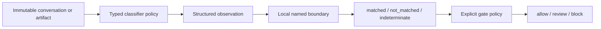

# Architecture

PsySafe separates observation, calibration, and action so model output is never itself an authorization decision.



## Package boundaries

| Module | Responsibility |
| --- | --- |
| `psysafe.core` | Immutable messages/conversations, categorical assessment contracts, protocols, and failure policy |
| `psysafe.backends` | Structured OpenAI, Anthropic, and callable-provider boundaries with sanitized failures |
| `psysafe.classifiers` | Fixed policies, typed observations, deterministic calibration, and local PII detection |
| `psysafe.gates` | Role-bound workflow checkpoints and explicit `allow` / `review` / `block` routing |
| `psysafe.evaluation` | Strict JSONL golden cases, family-safe splits, aggregate metrics, and monotonicity checks |
| `psysafe.integrations` | Optional lifecycle adapters for the OpenAI Agents SDK and Claude Agent SDK |

The package root imports no optional provider or agent SDK. Missing extras fail when their concrete adapter is used, not when `import psysafe` runs.

## Observation and calibration

An LLM-backed `PolicyClassifier` sends two distinct values to a structured backend:

- fixed provider instructions loaded from a versioned package resource; and
- an encoded conversation containing role, generated positional ID, and content.

The selected `Sensitivity` is not included. The provider returns a typed `Observation` with a bounded collection of categorical findings and one directness label per finding. Local calibration then filters findings according to a fixed monotonic mapping:

```text
precise        = explicit
balanced       = explicit + contextual
precautionary  = explicit + contextual + ambiguous
```

This design supports cheap policy comparison and makes the sensitivity behavior directly testable. It does not make the underlying observation infallible: provider/model changes still require evaluation.

## Evidence binding

Provider-facing messages use generated IDs (`m0`, `m1`, …); caller-supplied record, account, or patient IDs are not copied into instructions or results. Message content is still provider-bound and may itself contain identifiers.

Target-aware classifiers can use the whole conversation for context but require actionable findings to cite one selected message with the classifier's expected role. A gate adds an opaque `artifact_id` so the application can bind a decision to an immutable version of input, task, plan, tool payload, or response.

Observation records are validated data models, not signed attestations. After serialization or a trust-boundary crossing, revalidate a record against the original ordered conversation before relying on its citations.

## Failure model

The public assessment has a real abstention state: `indeterminate`. Refusals, timeouts, provider failures, malformed outputs, insufficient context, output saturation, and internal boundary failures never become `not_matched`.

`classify()` and `aclassify()` apply the configured `FailurePolicy`. `observe()` and `aobserve()` raise sanitized backend errors because a reusable observation cannot be fabricated. Gates convert classifier failures or invalid results into bounded indeterminate assessments and then apply a non-allow action.

Missing optional dependencies and invalid construction are configuration errors, not model outcomes. Cancellation propagates rather than being rewritten as a safety decision.

## Gate model

Every `WorkflowGate` or `AsyncWorkflowGate` owns exactly one `Checkpoint`:

- `input`
- `task_selection`
- `execution`
- `tool_input`
- `tool_output`
- `communication`

Checkpoint roles are enforced at construction. Multiple async classifiers run concurrently but decisions remain in deterministic configuration order. The strongest configured action wins (`block` over `review` over `allow`). A `GatePolicy` can override actions per classifier while preventing `indeterminate` or review-only signals from being configured to allow.

Gates retain their immutable configuration, not conversation, assessment, or decision data.

## Agent adapter boundary

The adapters translate native SDK lifecycle objects into bounded canonical text, call an `AsyncWorkflowGate`, and translate the categorical action back into the SDK's native tripwire, tool exception, hook permission, or stop response.

Serialization accepts only exact JSON-compatible built-ins with caps on depth, nodes, items, strings, integer size, and rendered bytes. Cycles, non-finite values, arbitrary objects, subclasses, and malformed SDK values fail closed with a fixed data-free exception. The OpenAI adapter additionally rejects recognized structured-media items; the Claude adapter treats JSON-compatible media references as ordinary structured data. Tool artifact IDs bind both the SDK call ID and exact canonical payload so a decision cannot be reused for a mutated call.

Framework limitations remain application responsibilities: hook coverage differs, post-tool checks cannot undo side effects, and final-output checks are not streaming filters.

## Extension points

For another structured provider, implement `StructuredBackend.complete()` and `acomplete()` and return an exact instance of the requested Pydantic output type. Collapse provider-specific exceptions to PsySafe's sanitized backend categories.

For another classifier, subclass `PolicyClassifier`, define a small typed `Finding`/`Observation` vocabulary, provide a concise fixed policy resource, identify the evidence role, and test all named boundaries. Avoid open-ended reasoning fields and person-level inferences.

For another orchestrator, adapt its native lifecycle boundary to `AsyncWorkflowGate`. Preserve exact artifact binding, bounded canonical serialization, cancellation, non-allow abstention, and data-free exceptions.
