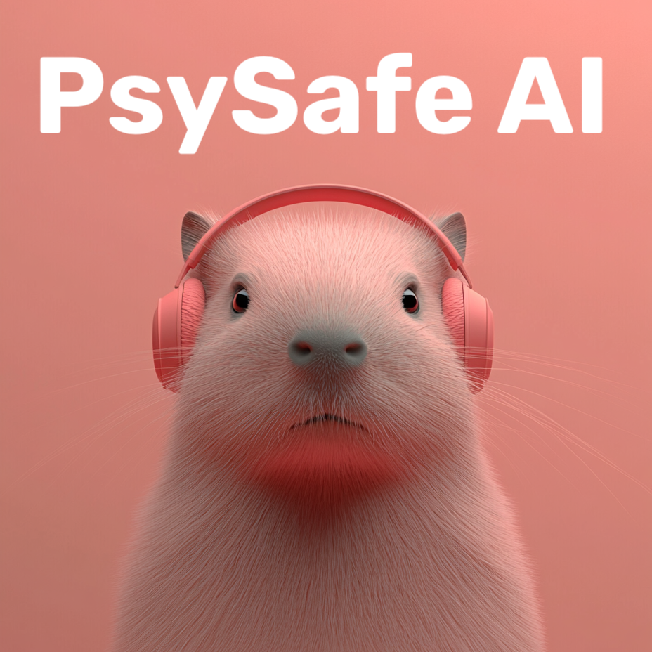

# PsySafe AI Documentation

<div align="center">

</div>

Welcome to the PsySafe AI documentation. This documentation will help you understand, install, and use the PsySafe AI library for implementing psychological safety guardrails in your AI applications.

## Documentation Sections

### Core Documentation

- [**Library Overview**](./library_overview.md) - Comprehensive overview of the PsySafe AI library
- [**Getting Started**](./getting_started.md) - Installation and basic usage guide
- [**Architecture**](./architecture.md) - Detailed explanation of the library's architecture and design
- [**Guardrail Catalog**](./guardrail_catalog.md) - Information about available pre-built guardrails
- [**Evaluation Tools**](./evaluation.md) - Guide to using the library's evaluation tools

### Additional Resources

- [**GitHub Repository**](https://github.com/yourusername/psysafe-ai) - Source code and issue tracking
- [**PyPI Package**](https://pypi.org/project/psysafe-ai/) - Python package information

## Quick Start

### Installation

```bash
pip install psysafe-ai
```

### Basic Usage

```python
from psysafe.drivers.openai import OpenAIChatDriver
from psysafe.catalog import GuardrailCatalog

# Initialize a driver
driver = OpenAIChatDriver(model="gpt-4")

# Load a guardrail from the catalog
guardrail = GuardrailCatalog.load("vulnerability_detection")[0]

# Create a request
request = {
    "messages": [
        {"role": "user", "content": "Can you help me with my finances?"}
    ]
}

# Apply the guardrail to modify the request
guarded_request = guardrail.apply(request)

# Send the modified request to the LLM
response = driver.send(guarded_request.modified_request)

# Print the response
print(response["choices"][0]["message"]["content"])
```

## Key Features

- **Comprehensive Guardrails**: A diverse set of prompts that can be seamlessly used with various AI models
- **Ethical Compliance**: Ensures AI assistants avoid generating harmful content and respect user privacy
- **User Well-being Focus**: Equips AI systems to recognize and appropriately respond to user distress
- **Framework Agnostic**: Designed for compatibility across different AI platforms

## Getting Help

If you encounter any issues or have questions about using PsySafe AI:

1. Check the documentation sections above
2. Look for similar issues in the [GitHub Issues](https://github.com/yourusername/psysafe-ai/issues)
3. Create a new issue if your problem hasn't been addressed

## Contributing

Contributions to PsySafe AI are welcome! Please see the [contributing guidelines](https://github.com/yourusername/psysafe-ai/blob/main/CONTRIBUTING.md) in the repository for more information.

## License

PsySafe AI is licensed under the MIT License. See the [LICENSE](https://github.com/yourusername/psysafe-ai/blob/main/LICENSE) file for details.