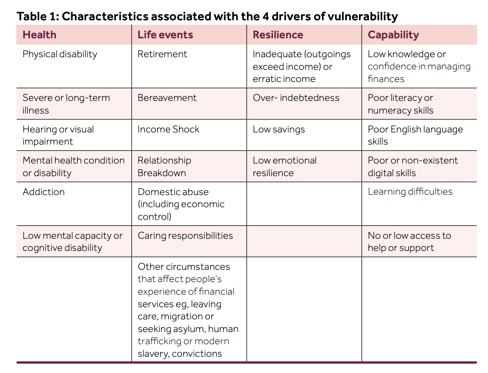

# Vulnerability Classification in AI Chat Interactions

by Martin Lukac, PhD.

## Executive Summary

Vulnerability classification in AI chat interactions involves detecting when a user may be at a heightened risk of harm or undue influence during a conversation. This report provides a detailed overview of how vulnerability is defined in both regulatory and academic contexts, why certain conversational cues are critical for detecting a vulnerable user, and how an AI-based classifier can be tuned for different sensitivity levels. Key regulatory bodies — including the UK’s FCA [^1], the EU’s GDPR [^2] and AI Act [^3], and the US FTC [^4] — recognise that some individuals (e.g. those with particular personal circumstances or diminished capacities) are especially susceptible to harm. Academic research further expands this concept to digital vulnerability, noting that the online environment itself can create new vulnerabilities even for otherwise capable users [^5].

We justify a classifier design that monitors indicators such as emotional distress, cognitive confusion, and low digital literacy, as these often correlate with a user’s inability to protect their interests. For instance, regulators note that poor mental health or low literacy can increase one’s risk of harm [^1], and scammers commonly exploit fear, trust, or lack of digital know-how to manipulate people [^6]. To adapt the classifier to various use-cases, we propose a flexible sensitivity schema (low, medium, high) that balances thoroughness of detection against false alarms.

  

## Definition of Vulnerability

### Regulatory Perspectives

Regulatory agencies and laws offer complementary definitions of vulnerability in the context of consumers and data subjects. The UK Financial Conduct Authority (FCA) defines a vulnerable customer as “someone who, due to their personal circumstances, is especially susceptible to harm – particularly when a firm is not acting with appropriate levels of care.” [^1]. This view sees vulnerability as a spectrum: anyone can become vulnerable if their circumstances change, with **certain characteristics of vulnerability** (e.g. poor health or cognitive impairment, life events like bereavement or job loss, low emotional resilience, or low capability such as poor literacy/numeracy) increasing that risk.

  

In the EU, the General Data Protection Regulation (GDPR) does not explicitly define “vulnerable persons” in an article, but its recitals recognise that **children merit specific protection** and are considered “vulnerable natural persons” under data protection law [^2]. GDPR guidance and the ICO also note that other individuals — such as the elderly, people with disabilities or mental health conditions, asylum seekers, and the seriously ill — may be vulnerable, often because they “may not have capacity to act or advocate for themselves” (for example, to give fully informed consent) [^7]. This means extra care is required when processing their data or communicating with them. 

The proposed EU AI Act takes vulnerability into account as well: it outright prohibits AI systems that exploit the vulnerabilities of specific groups (for instance, based on age, disability, or social/economic disadvantage) in ways that cause or are likely to cause harm. This prohibition covers manipulative or deceptive AI behavior that "exploits other individual vulnerabilities _and_ influences their behaviour or choices to a point of creating significant harm" [^8]. In practice, an example given is highly persuasive content targeting people in dire financial situations and causing them financial harm, which would be disallowed. The AI Act and related digital regulations also broaden the scope of who might be considered vulnerable — beyond the traditional categories of minors, the elderly or disabled, new proposals include groups like migrants, people living in poverty, and those receiving public assistance as potentially vulnerable users of AI [^9].

In the United States, the Federal Trade Commission (FTC) similarly emphasises protecting vulnerable populations under its mandate to prevent unfair or deceptive practices. The FTC has the authority to regulate marketing practices directed at vulnerable groups (e.g. children or seniors), recognising that these populations can be disproportionately harmed by deception [^10]. For example, the FTC reports annually on fraud targeting older adults and has established initiatives (like the Stop Senior Scams Act) to coordinate protection for seniors [^11].

Across these regulatory perspectives, a common theme is that vulnerability is understood as an elevated risk of harm or disadvantage due to personal factors (like age, health, or literacy) or situational factors (like isolation or economic hardship). **Organisations deploying AI, especially in customer-facing chat interactions, are expected to be mindful of these factors to avoid exploiting or worsening a user’s vulnerable position.**

### Academic Perspectives
The concept of vulnerability has been expanded in light of digital technology and AI. Traditionally, vulnerability was often seen as an intrinsic status of particular groups (the old, the young, the infirm, etc.), but recent scholarship introduces the idea of **digital vulnerability** as a more universal and contextual condition. Rather than being tied solely to inherent traits, digital vulnerability is described as a "universal state of powerlessness present within the digital environment" [^9]. In other words, modern online platforms and AI-driven services can create situations where any user — not just those from traditionally vulnerable groups — might experience reduced autonomy or increased risk. 

Researchers Sax and Helberger [^9] identify three key elements characterising digital vulnerability:

1. **Relational** nature: Vulnerabilities emerge from the interplay between users and digital systems, which may hold significant informational or persuasive power.
2. **Architectural nature**: The design choices within digital platforms and AI services can unintentionally lead users into situations where their autonomy is compromised.
3. **Privacy Considerations**: Data-driven personalization can inadvertently expose or amplify vulnerabilities by leveraging sensitive personal information.

Crucially, these perspectives underscore that vulnerability in AI interactions is not always deliberate or malicious but can be an unintended consequence of system design and user-system interactions. Even digitally savvy individuals can find themselves temporarily vulnerable, influenced by persuasive interfaces, confusing interactions, or cognitive overload. Academic literature thus advocates for proactive measures, suggesting that detecting vulnerability should become an integral, routine part of designing AI-driven applications.

In practical terms, this implies that AI chatbot providers should implement systems capable of recognising vulnerability indicators — either the traditional ones (poor health, life events such as bereavement or job loss, etc.) as well as the expanded definition (emotional distress, cognitive overload, or sudden shifts in behavior, low capability, etc.) — and adapt their responses accordingly. **By integrating even lightweight classifiers that monitor interactions, providers can proactively manage user journeys, reducing unintended risks and enhancing user autonomy and well-being.** This approach aligns with academic calls for AI systems to empower rather than inadvertently exploit or overwhelm users, making vulnerability classification a critical component of responsible AI design.

## Justification for Classifier Design

Designing a classifier to detect vulnerable users in AI chat interactions requires selecting indicators — observable signals in the user’s messages or behaviour — that strongly suggest vulnerability. These indicators can be categorised into external indicators, stemming from a user's circumstances or environment, and internal indicators, related to personal cognitive or emotional traits.

**External indicators** include situational factors such as job loss, financial hardship, poor health, recent bereavement or significant life changes, social isolation, and economic disadvantage.

**Internal indicators** encompass personal traits or states like emotional distress, low cognitive capability, cognitive confusion or impairment, diminished emotional resilience, poor literacy or numeracy skills, and low digital literacy.

These indicators are supported by both regulatory guidance and real-world evidence as strongly correlated with increased vulnerability in online interactions. By considering external and/or internal dimensions, the classifier can effectively identify situations where users might be susceptible to harm, enabling AI providers to proactively adapt user journeys, provide supportive responses, and mitigate potential risks.

### Shades of Vulnerability

**Job loss** refers to losing one’s employment (often involuntarily through layoffs or firings). It is considered a highly stressful life event that can upend a person’s income, daily routine, and sense of identity. Research in psychology finds that losing a job disrupts more than finances — it undermines status, structure, self-esteem, and social connections, often creating anxiety, insecurity, and shame [^12]. Users who have lost their job may reveal it explicitly (e.g., "I was laid off yesterday" or "I’m unemployed now") or implicitly by discussing financial worries or seeking career help. Additionally, a noticeable shift in tone — for instance, a user who was previously upbeat becoming despondent or anxious when talking about work — can signal job loss-related distress.

**Financial hardship** is generally defined as difficulty meeting basic living needs or financial obligations [^13]. This could mean struggling to pay bills, afford food and housing, or carrying unmanageable debt. Financial hardship is a well-documented risk factor for stress and mental health problems. In chat interactions, users undergoing financial hardship might mention problems like "I can’t pay my bills," "I’m drowning in debt," or requests for help with money, loans, or budgeting. They may express anxiety about expenses or use language indicating stress over making ends meet (for example, asking about "payday loans" or "selling possessions for cash" could be red flags). 

**Poor health** as a vulnerability indicator includes chronic illnesses, disabilities, or any physical/mental conditions that impair daily functioning. The UK’s FCA defines health-related vulnerability as any condition or illness that affects the ability to carry out daily tasks [^1]. Serious health issues can make a person dependent on others, limit their income or mobility, and increase stress. Moreover, managing an illness often monopolises a person’s attention and resources, so they may be less resilient to additional problems. Users might disclose their health conditions to a chatbot (e.g., "I have cancer and I’m exhausted," or "My disability makes it hard to understand this"). They could also imply poor health through statements about frequent hospital visits, feeling unwell, or memory and concentration issues. An AI agent can detect health-related vulnerability by picking up on mentions of illnesses, medications, pain, or mental health terms (like "I'm feeling very depressed lately").

**Bereavement** — the loss of a loved one — and other major life changes (divorce, retirement, relocation, etc.) are disruptive events that can leave individuals highly vulnerable. They fall under “life events” that often trigger vulnerability. Psychologically, intense grief can temporarily impair one's cognitive functions: "Grief can rewire our brain in a way that worsens memory, cognition, and concentration. You might feel spacey, forgetful, or unable to make ‘good’ decisions." [^14] Users experiencing bereavement might explicitly mention a death (e.g., "My father passed away last week") or express emotions of profound sadness, numbness, or confusion. They might ask questions that reflect their pain (such as coping with loss or drastic changes in their life). Indicators of grief or major life stress in text can include expressions of hopelessness, shock, or statements like "I don't know how to go on".

**Social isolation** refers to having minimal social contact or support from others. Loneliness and isolation are significant vulnerability factors, as humans are inherently social creatures. Being chronically isolated can lead to or worsen mental and physical health issues. Research has linked social isolation and loneliness to higher risks of depression, anxiety, cognitive decline, and even physical ailments like heart disease [^15]. Social isolation also often accompanies or exacerbates other vulnerabilities (like poor health or bereavement), compounding its impact. In a chat context, socially isolated users might say things like "I have no one else to talk to," "I’m alone," or "I haven’t seen my friends/family in ages." They may use the chatbot very frequently for companionship, indicating loneliness.

**Emotional distress** describes a state of significant psychological suffering – it can include feelings of extreme anxiety, sadness, anger, or agitation. It is essentially a strong negative emotional reaction to stress or crisis. By definition, "emotional distress" is a general term for a wide range of negative emotional reactions people have in response to a stressful situation​. When someone is in acute emotional distress, their ability to process information and make rational decisions is compromised. High distress often demands immediate relief, which can lead to impulsive or irrational choices. A chatbot can detect emotional distress through sentiment analysis and tone. Indicators include messages written in all caps (often indicating yelling or panic), frequent usage of emotionally loaded words like "terrified," "helpless," "angry," "upset," or crying emojis. The user's language may be incoherent or repetitively focused on an emotional trigger (e.g., "I can’t take this anymore" or "I’m so scared it hurts"). Rapid-fire messages or very lengthy venting messages are also signs of distress.

**Low cognitive capability** refers to below-average ability in intellectual functions such as comprehension, reasoning, memory, or problem-solving. This could be due to intellectual disability, developmental disorders, brain injury, or other factors. People with lower cognitive capabilities may struggle to understand complex language or concepts. This contributes to vulnerability because they can be easily confused or misled [^15]. They may also have trouble articulating their needs, making it hard for them to get appropriate help without guidance. A chatbot might infer low cognitive capability if the user consistently uses very simple vocabulary or grammar, appears to misunderstand basic concepts, or repeatedly asks for clarification on instructions that are normally considered straightforward. Detection of low cognitive capability is, however, still very emotionally loaded and challenging.

**Cognitive confusion or impairment** covers temporary or situational cognitive impairment — instances where a user is confused, disoriented, or suffering memory/thinking problems (for example, an elderly user with mild dementia or someone experiencing brain fog). Even if a person's overall cognitive ability is normally average, factors like early dementia, a concussion, or acute stress can cause significant confusion. Cognitive confusion increases vulnerability because a confused person might not follow conversation logic well, could be forgetful (not recalling what was said earlier), and can be easily convinced of false information [^16]. Signs of cognitive confusion in chat might include the user asking the same question repeatedly as if it's new, indicating short-term memory issues. Their messages might trail off or switch topics incoherently. They could also express their confusion explicitly: "I'm sorry, I'm a bit confused, what does that mean again?" or "I don’t remember what we talked about earlier." The chatbot could detect this by tracking context recall — if the user forgets information given just a few moments ago, that’s a flag.

**Emotional resilience** is the ability to cope with stress and adversity — to "bounce back" or adapt in the face of challenges [^17]. Diminished emotional resilience means this coping ability is reduced. Such individuals struggle to handle even minor shocks or difficulties without becoming upset or destabilized. The FCA categorizes this as reduced ability to withstand financial or emotional shock [^1]. When someone has low resilience, a small setback can feel like a crisis. They may become emotionally overwhelmed quickly, which in turn makes them vulnerable. A user with low emotional resilience may show an exaggerated emotional response to relatively small issues. The chatbot could detect patterns of emotional volatility: frequent swings from calm to very upset within a short conversation over trivial matters.

## Flexible Sensitivity Schema

When implementing a vulnerability classifier, a one-size-fits-all sensitivity can be problematic. In some contexts (e.g. a mental health support chatbot), we may want the system to be extremely sensitive to any hint of distress; in others (e.g. a general customer service bot), an overly sensitive classifier might flag too many false positives and interrupt the experience unnecessarily. To address this, we propose a flexible sensitivity parameter schema that allows tuning the strictness of the classifier’s judgments. This schema could be set by the developers or even adjusted in real-time based on context or user preferences. We outline three levels of sensitivity – Low, Medium, High – along with how the classifier should behave in each mode:

Low Sensitivity: This is a conservative setting where the classifier only flags a user as vulnerable when there are clear, strong indicators present. It prioritizes avoiding false positives. In the low setting, the AI will require multiple or very explicit signals of vulnerability before classifying the user as such. For example, it might act only if a user explicitly says something like “I am feeling suicidal” or if several indicators (e.g. crying emoji + statements of confusion + mention of mental illness) are all detected together. Minor hints of frustration or slight sadness would not trigger a vulnerability label under low sensitivity. This setting might be appropriate for scenarios where interventions are costly or intrusive – for instance, a busy customer support center that only wants to escalate genuinely critical cases. Technically, this corresponds to a high threshold for the classifier: the model might need, say, >90% confidence of vulnerability before flagging. The trade-off is that some genuinely vulnerable users with subtle signals might be missed (higher false negatives), but those flagged are very likely to truly need help.

Medium Sensitivity: The medium setting offers a balanced approach between caution and proactiveness. The classifier will flag vulnerability when there are noticeable indicators, even if they are not extreme, but it will ignore very ambiguous or borderline cases. This might mean the threshold is moderate – catching most cases where a user shows a reasonable level of distress or confusion, while still filtering out noise. For instance, a user repeatedly asking for help and showing signs of agitation would be marked as vulnerable in medium mode, even if they haven’t explicitly said they are in crisis. However, a single mild statement like “I’m a bit upset today” might not immediately trigger it without additional context. Medium sensitivity aims for a good precision-recall balance: it strives to catch vulnerable users with fair reliability while minimizing false alarms. This level could be the default for many applications, providing a safety net for users in need without overwhelming the system (or the users) with constant interventions. In practice, medium sensitivity might align with, say, a 70-80% confidence threshold in the classification model, or using a scoring system where moderate evidence is sufficient for a flag.

High Sensitivity: This is a maximally cautious setting where the classifier errs on the side of identifying vulnerability even on tenuous evidence. In high sensitivity mode, the slightest indicator or hint could result in a user being flagged as potentially vulnerable. The system is tuned to have very few false negatives (i.e., try not to miss anyone who might be vulnerable), accepting that there will be more false positives. For example, if a user’s message includes any emotional language (even something like “I’m having a rough day”), the classifier might flag it and perhaps ask a gentle probing question or switch to a more empathetic tone. High sensitivity might be used in sensitive domains like mental health support, suicide prevention chats, or when interacting with known vulnerable groups (e.g., an AI tutor for children might run in high sensitivity to catch any sign of bullying or distress). The threshold for flagging is low – the model might act on a low confidence (like >50% likelihood of vulnerability). This setting ensures that virtually all potential cases of vulnerability are caught (maximizing recall), which is crucial when missing a case could mean serious harm. The downside is the classifier will likely produce some false alarms, flagging users who are actually fine. To mitigate disruption, the system’s response to a flag at high sensitivity can be mild (for example, just increasing politeness or offering help, rather than calling emergency services outright). In summary, high sensitivity mode treats “better safe than sorry” as the guiding principle.

Implementing these sensitivity levels could be as simple as an adjustable threshold in the model’s decision function, or more complex like switching between different models or prompt formulations tuned for each level. The key benefit of a flexible schema is customization – it allows the AI provider to tailor the classifier’s strictness to the context of use and risk tolerance. For instance, an enterprise might start with medium sensitivity and then adjust to high if they notice they’re still missing some vulnerable users in testing. Or an AI could dynamically raise sensitivity if it detects conversation topics that are inherently higher-risk (imagine a chatbot noticing the user is talking about health or finances might temporarily go to high sensitivity). This schema supports AI ethics by aligning the system’s behavior with the needs of the situation: low sensitivity avoids patronizing or over-policing users, while high sensitivity ensures help is offered wherever needed. Such tuning also reflects NLP best practices in deployment, where models often need calibration to balance precision and recall for the target scenario. In sum, providing low, medium, and high sensitivity options makes the vulnerability classifier versatile and context-aware, enabling a safer and more considerate AI chat experience for all users.

[^1]: Financial Conduct Authority – Guidance on the Fair Treatment of Vulnerable Customers

[^2]: GDPR Recital 75 – Vulnerable Data Subjects (Children specifically); GDPR and Vulnerable People (ICO)

[^3]: EU Artificial Intelligence Act – Prohibited AI Practices (Exploitation of Vulnerabilities); Academic analysis of digital vulnerability in EU law

[^4]: Pomeranz, FTC Authority to Regulate Marketing to Children (and vulnerable populations); FTC Press Release on Protecting Older Adults (2024)

[^5]: Maastricht University. (2023, February). Digital vulnerability of the AI-assisted consumers. Retrieved from https://www.maastrichtuniversity.nl/blog/2023/02/digital-vulnerability-ai-assisted-consumers

[^6]: New America, Empowering Vulnerable Communities Against Online Scams – example of scams exploiting low digital literacy and trust

[^7]: Vulnerability Registration Service. (n.d.). Data, vulnerability & GDPR: Considerations for businesses. Retrieved March 5, 2025, from https://www.vulnerabilityregistrationservice.co.uk/data-protection-gdpr-and-vulnerability/

[^8]: Shrishak, K. (2025, February 21). EU's AI Act: Tread the guidelines lightly. TechPolicy.Press. https://www.techpolicy.press/eu-ai-act-tread-the-guidelines-lightly/

[^9]: Sax, M., & Helberger, N. (2024). Digital vulnerability and manipulation in the emerging digital framework. In N. Helberger, B. Kas, H.-W. Micklitz, M. Namysłowska, L. Naudts, P. Rott, M. Sax, & M. Veale (Eds.), Digital fairness for consumers (pp. 10–24). BEUC. https://pure.uva.nl/ws/files/181992648/Digital_vulnerability_BEUC-X-2024-032.pdf

[^10]: Pomeranz, J. L. (2011). Federal Trade Commission's authority to regulate marketing to children: Deceptive vs. unfair rulemaking. Health Matrix: Journal of Law-Medicine, 21(2), 521–553.

[^11]: Federal Trade Commission. (2024, October 30). FTC issues annual report to Congress on agency's actions to protect older adults. Retrieved from https://www.ftc.gov/news-events/news/press-releases/2024/10/ftc-issues-annual-report-congress-agencys-actions-protect-older-adults

[^12] Brand, J. E. (2015). The far-reaching impact of job loss and unemployment. Annual Review of Sociology, 41, 359–375. https://doi.org/10.1146/annurev-soc-071913-043237​

[^13] Jiménez-Solomon, O., Primrose, R., Moon, I., Wall, M., Galfalvy, H., Méndez-Bustos, P., Cruz, A. G., Swarbrick, M., Laing, T., Vite, L., Kelley, M., Jennings, E., & Lewis-Fernández, R. (2022). Financial hardship, hope, and life satisfaction among un/underemployed individuals with psychiatric diagnoses: A mediation analysis. Frontiers in Psychiatry, 13, Article 867421. https://doi.org/10.3389/fpsyt.2022.867421

[^14] Pedersen, T. (2022, May 6). What does grief do to your brain? Psych Central. https://psychcentral.com/lib/your-health-and-grief

[^15] Lambert, I., Wright, N., Gardner, A., Fyson, R., Abubakar, A., & Clawson, R. (2024). Cognitive impairment as a vulnerability for exploitation: A scoping review. Trauma, Violence, & Abuse. Advance online publication. https://doi.org/10.1177/15248380241282993​

[^16] Ueno, D., Daiku, Y., Eguchi, Y., Iwata, M., Amano, S., Ayani, N., Nakamura, K., Kato, Y., Matsuoka, T., & Narumoto, J. (2021). Mild cognitive decline is a risk factor for scam vulnerability in older adults. Frontiers in Psychiatry, 12, 685451. https://doi.org/10.3389/fpsyt.2021.685451​
